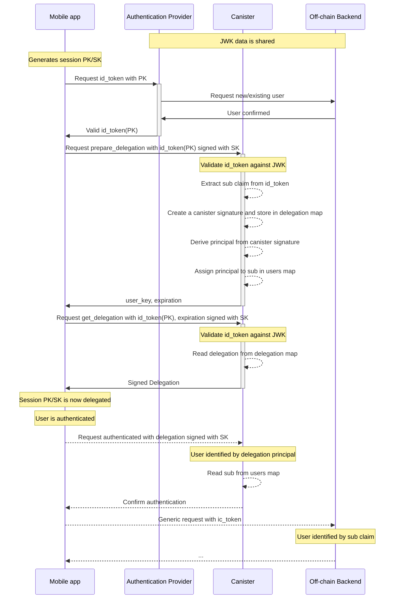

# React Native (Expo) app with JWT Authentication and IC Rust canister

This is a Proof-of-Concept [React Native Expo](https://expo.dev/) mobile application that uses [JSON Web Tokens](https://jwt.io/) to authenticate to an [Internet Computer canister](https://internetcomputer.org/docs/current/concepts/canisters-code).

The main idea behind this PoC is to have an off-chain [OpenID](https://openid.net/specs/openid-connect-core-1_0.html) authentication service ([Auth0](https://auth0.com) in this case) that mints a JWT that the user can send to the canister to generate a delegated [identity](https://internetcomputer.org/docs/current/concepts/glossary/#identity). This way, the user can identify themselves on the canister with the same [principal](https://internetcomputer.org/docs/current/concepts/glossary/#principal) across sessions. It offers a trade-off between ease of use for the end user and decentralization of the authentication process.

This PoC has the following components:

- React Native Expo mobile app: [src/app](./src/app)
- off-chain TypeScript backend: [src/app_backend](./src/app_backend)
- IC Rust backend canister: [src/ic_backend](./src/ic_backend)
- [Auth0](https://auth0.com/) authentication provider

Head over to the [How it works](#how-it-works) section for more details.

## Requirements

- [Bun](https://bun.sh/) Javascript runtime
- [Expo's requirements](https://docs.expo.dev/get-started/installation/#requirements) and [local development prerequisites](https://docs.expo.dev/guides/local-app-development/#prerequisites)
- [Rust](https://www.rust-lang.org/) with the `wasm32-unknown-unknown` target:

    ```bash
    rustup target add wasm32-unknown-unknown
    ```

- [dfx](https://internetcomputer.org/docs/current/developer-docs/getting-started/install/) (better if installed with the dfx version manager - [`dfxvm`](https://github.com/dfinity/dfxvm))
- an [Auth0](https://auth0.com) account
- an Android/iOS device or simulator

### Configure Auth0

Follow these steps to configure Auth0:

1. [Create a Tenant](https://auth0.com/docs/get-started/auth0-overview/create-tenants) and get your Auth0 Tenant domain, which looks like `<TENANT_NAME>.<TENANT_REGION>.auth0.com`
2. [Create a Native Application](https://auth0.com/docs/get-started/auth0-overview/create-applications/native-apps)
3. In the _Dashboard > Applications > YOUR_APP > Settings_ tab, set the **Allowed Callback URLs** and **Allowed Logout URLs** to:
    - `io.icp0.jwtauthdemo.auth0://<YOUR_AUTH0_TENANT_DOMAIN>/ios/io.icp0.jwtauthdemo/callback`
    - `io.icp0.jwtauthdemo.auth0://<YOUR_AUTH0_TENANT_DOMAIN>/android/io.icp0.jwtauthdemo/callback`

    Where `<YOUR_AUTH0_TENANT_DOMAIN>` is the Auth0 Tenant domain and `io.icp0.jwtauthdemo` is both the **Android Package Name** and **iOS Bundle Identifier**, as configured in the [app.config.js](./src/app/app.config.js) file.
4. In the _Dashboard > Applications > YOUR_APP > Credentials_ tab, set the **Authentication Method** to **None** (instead of **Client Secret (Post)**)

The 1st step of the Auth0 React Native [Quickstart interactive guide](https://auth0.com/docs/quickstart/native/react-native-expo/interactive) can be helpful too.

## Usage

Install the dependencies:

```bash
bun install
```

Copy the [`.env.example`](./.env.example) file to `.env`:

```bash
cp .env.example .env
```
and replace the values with your own.

Start the IC backend:

```bash
# in terminal 1
bun start:dfx
# in terminal 2
bun deploy:ic_backend
```

Start the off-chain backend:

```bash
# in terminal 3
bun start:app_backend
```

Start the mobile app:

```bash
# in terminal 4
cd src/app
cp ../../.env .env
bun expo prebuild
cd ../..
# if you want to start the app for Android
bun start:android
# if you want to start the app for iOS
bun start:ios
```
> You may need to manually start the Android/iOS emulator.

See the `expo start` CLI [docs](https://docs.expo.dev/more/expo-cli/#develop) for more information.

## Testing

Integration tests are available for the IC Rust backend canister. Simply run:

```bash
./scripts/integration-test.sh
```

## How it works

This PoC is highly inspired by [this discussion](https://forum.dfinity.org/t/25334/7) on the Internet Computer forum.



The main steps are:

0. The JWKs must be fetched from Auth0 and stored in the canister and off-chain backend.

    In the current implementation, the canister fetches them once on deployment and every **1 hour** using the [HTTPS outcalls](https://internetcomputer.org/docs/current/references/https-outcalls-how-it-works/) and [Timers](https://internetcomputer.org/docs/current/developer-docs/smart-contracts/advanced-features/periodic-tasks/) features.
1. The mobile app generates a new session PK/SK pair;
2. The mobile app requests an [`id_token`](https://openid.net/specs/openid-connect-core-1_0.html#IDToken) from the authentication provider, setting the `nonce` claim to the session PK (encoded as a hex string);
3. The authentication provider creates the new user or fetches the existing user on the off-chain backend/database, then mints a valid `id_token` that contains the `nonce` claim as requested;
4. The mobile app sends an [update call](https://internetcomputer.org/docs/current/developer-docs/smart-contracts/call/overview/#update-calls) to the `prepare_delegation` method of the canister, with the `id_token` as argument. This update call is signed with the session PK/SK pair;
5. The canister performs the following operations:

    a. Validates the `id_token` against the JWK and by verifies that:

    - it was issued by the JWKs fetched from Auth0
    - it is not expired (`exp` claim)
    - it was not issued more than **10** minutes ago (`iat` claim)
    - the issuer is the expected Auth0 tenant (`iss` claim)
    - the audience is the expected Auth0 application id (`aud` claim)
    - the session [self-authenticating principal](https://internetcomputer.org/docs/current/references/ic-interface-spec/#id-classes) derived from the session PK is equal to the caller (`nonce` claim)

    b. Extracts the `sub` and `nonce` claims from the `id_token`

    c. Hashes the `sub` and `nonce` claims together with a random `salt`. The DER-encoding of this hash is the `user_key`

    d. Creates a canister signature for the `user_key` and stores it in the `delegation` map

    e. Derives a self-authenticating principal from the `user_key`. This is the principal with which the mobile app will authenticate to the canister and will be the same across sessions and canister upgrades.

    f. Assigns the principal to the `sub` claim in the `users` map. This map is used to retrieve the user `sub` claim in all the methods that the user will use after completing the authentication flow, see **step 7.**

    If all these steps succeed, the canister returns the `user_key` and the expiration of the delegation, which is set to the `exp` claim of the `id_token`.

6. The mobile app sends a [query call](https://internetcomputer.org/docs/current/developer-docs/smart-contracts/call/overview/#query-calls) to the `get_delegation` method of the canister, with the `id_token` and `expiration` as arguments. This query call is signed with the session PK/SK pair.

    This method performs the same validation on the `id_token` as in the previous step and returns the delegation along with the canister signature.

7. The mobile app can now create a delegated identity, with which it can send subsequent requests to the canister, for example to the `authenticated` method.

    The `authenticated` method is just a demo method to show that the user is authenticated with the delegation obtained from the canister and its `sub` claim can be retrieved from the `users` map.

8. The mobile app can also send authenticated requests to the off-chain backend, which can identify the user by the `sub` claim as well.

The [canister_sig_util](https://github.com/dfinity/internet-identity/tree/release-2024-03-22/src/canister_sig_util) crate from the Internet Identity source code is used as an helper for the signatures map.

## Roadmap

- [x] on the canister, periodically fetch the [JSON Web Key Sets (JWKS)](https://auth0.com/docs/secure/tokens/json-web-tokens/json-web-key-sets) from Auth0 using the [HTTPS outcalls](https://internetcomputer.org/docs/current/references/https-outcalls-how-it-works/) and [Timers](https://internetcomputer.org/docs/current/developer-docs/smart-contracts/advanced-features/periodic-tasks/) features.

    Right now, the JWKS are fetched at build time by the [build-canister.sh](./scripts/build-canister.sh) script, stored in `data/jwks.json` and imported in the canister as raw bytes at compile time ([source](https://github.com/ilbertt/ic-react-native-jwt-auth/blob/882539addd4e0e35fe1f1756701296f1ff085239/src/ic_backend/src/id_token.rs#L12)).

    Fetching the JWKS at runtime is needed because [JWK](https://datatracker.ietf.org/doc/html/rfc7517)s on Auth0 may rotate.

    Related issue: https://github.com/ilbertt/ic-react-native-jwt-auth/issues/1.
- [x] tests (integration)

    Related PR: https://github.com/ilbertt/ic-react-native-jwt-auth/pull/2.

## License

MIT License. See [LICENSE](./LICENSE).
